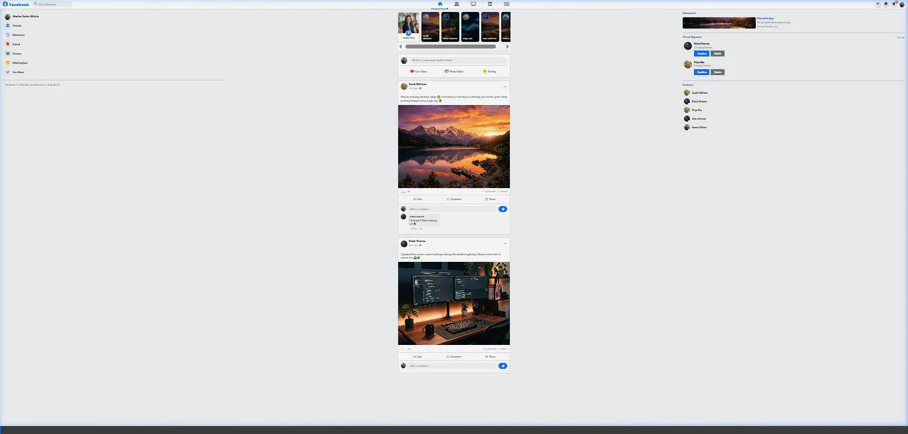

# 📘 ConnectHub (Facebook Clone) — Feature-Complete Social Platform

> A full-featured, responsive **Facebook clone** built with HTML5, CSS3, Bootstrap 5, and JavaScript. Designed with Facebook's signature blue palette, multi-tab navigation, post feeds, reactions, comments, story rails, profile management, and interactive widgets.

---

## 📹 10-Second Navigation Walkthrough



---

## 🌟 Key Features

* **Authentic Facebook UI**: Top navigation bar with search, Home, Watch, Marketplace, Groups, and Gaming tabs.
* **Interactive Main Feed**:
  * Post Creation composer supporting text, photos, feeling/activity tagging, and live location.
  * Multi-reaction system (Like, Love, Haha, Wow, Sad, Angry) with hover popups.
  * Real-time comment threads and share counter updates.
* **Stories Rail**: Horizontal story carousels featuring active user avatars and add-to-story buttons.
* **Sidebar Widgets**: Left navigation panel for shortcuts and Right sidebar for active contacts and sponsored ads.
* **Dark / Light Mode**: Seamless dark mode toggle with persistent local storage settings.

---

## 🛠️ Technology Stack

* **Frontend**: HTML5, Vanilla JavaScript
* **Styling**: Custom CSS3 & Bootstrap 5
* **Icons**: Font Awesome 6
* **Typography**: Segoe UI & Inter

---

## 🚀 Quick Start & Local Run

```bash
# Serve locally
cd Web-Development/facebook-clone
npx serve . -p 3005
```
Open your browser and visit: `http://localhost:3005`
