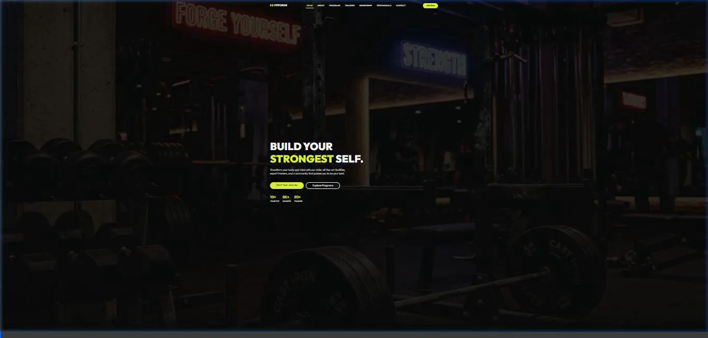

# 🏋️ ApexFit — Luxury Fitness & Gym Web Application

> A high-energy, modern **fitness and gym website** featuring dark luxury aesthetics, WHO-compliant interactive BMI calculator, training program catalog, trainer profiles, membership tier pricing, and instant enrollment modals.

---

## 📸 Interface Preview & 10-Second Navigation Walkthrough


> [!NOTE]
> Below is the full 10-second interactive navigation recording of the ApexFit fitness web application:



---

## 🌟 Key Features

* **Interactive WHO BMI Calculator**: Real-time Body Mass Index calculator with metric/imperial units, WHO health category indicators, and tailored workout recommendations.
* **Fitness Program Catalog**: Highlighting Strength Training, HIIT Cardio, Yoga & Mindfulness, Personal Training, and CrossFit with interactive detail modals.
* **Certified Trainer Showcase**: Professional profiles featuring specialized fitness achievements and booking triggers.
* **Membership Plans**: Tiered pricing tables (Basic, Pro, VIP) with feature breakdowns and instant join CTAs.
* **Modern High-Contrast UI**: Electric yellow & dark black luxury palette with responsive mobile navigation.

---

## 🛠️ Technology Stack

* **Frontend**: HTML5, Vanilla JavaScript (ES6+)
* **Styling**: Modern CSS3 (Custom Properties, Flexbox, Grid)
* **Framework**: Bootstrap 5
* **Icons**: Font Awesome 6

---

## 🚀 Quick Start & Local Run

```bash
# Serve locally
cd Web-Development/fitness-website
npx serve . -p 3006
```
Open your browser and visit: `http://localhost:3006`
