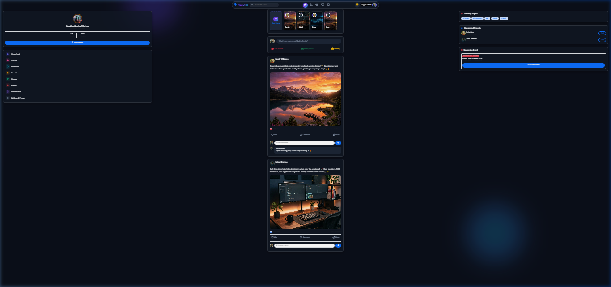
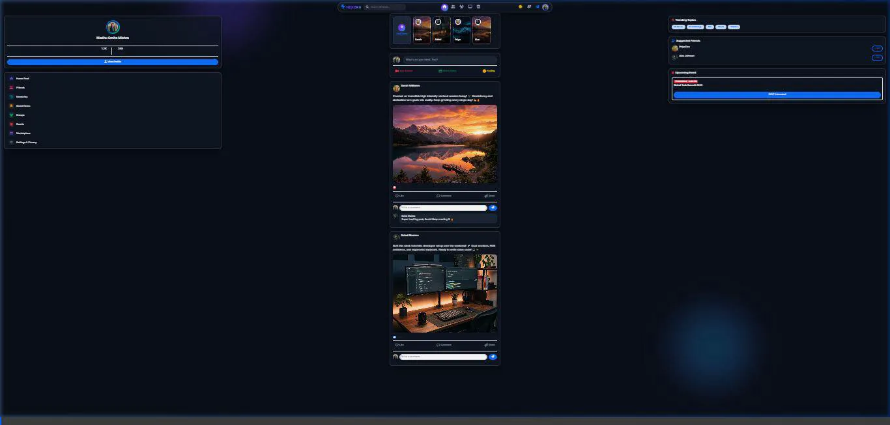

# 🚀 Nexora — 2026 Next-Gen Social Networking Platform

> A premium, modern, fully responsive **social media SaaS web application** featuring glassmorphism UI, real-time post creation, dark/light theme switching, live story reels, interactive reactions, and secure authentication workflows.

---

## 📸 Interface Preview & 10-Second Navigation Walkthrough



> [!NOTE]
> Below is the full 10-second interactive navigation recording of the Nexora web application:



---

## 🌟 Key Features

* **Futuristic Glassmorphism Aesthetic**: Vibrant dark/light mode engine, backdrop blur, translucent cards, smooth micro-interactions, and floating UI elements.
* **Interactive Social Feed**:
  * Rich post composer modal with image/video attachments and emoji picker.
  * Like, comment, bookmark, and share interactions with live counters.
  * Instagram-style horizontal story reels with ring highlights.
* **Authentication & Form Validation**:
  * Sign In and Sign Up modal forms with instant field validation.
  * Password strength meters and secure reset triggers.
* **User Profile & Activity Widgets**:
  * Floating user profile cards, trending topics, suggested connections, and notification centers.
* **Fully Responsive**: Mobile-first layout optimized across all screen sizes.

---

## 🛠️ Technology Stack

* **Frontend**: HTML5, Vanilla JavaScript (ES6+)
* **Styling**: Modern CSS3 (Glassmorphism, CSS Variables, Flexbox, Grid)
* **Icons**: Font Awesome 6 & Lucide Icons
* **Typography**: Google Fonts (*Outfit*, *Inter*)

---

## 🚀 Quick Start & Local Run

```bash
# Serve locally
cd Web-Development/nexora
npx serve . -p 3004
```
Open your browser and visit: `http://localhost:3004`
